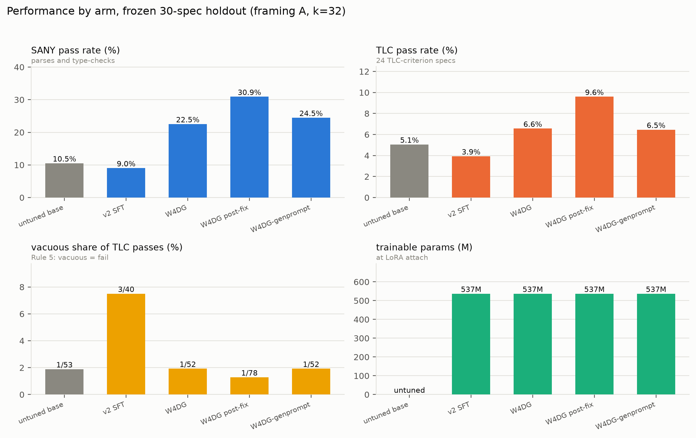
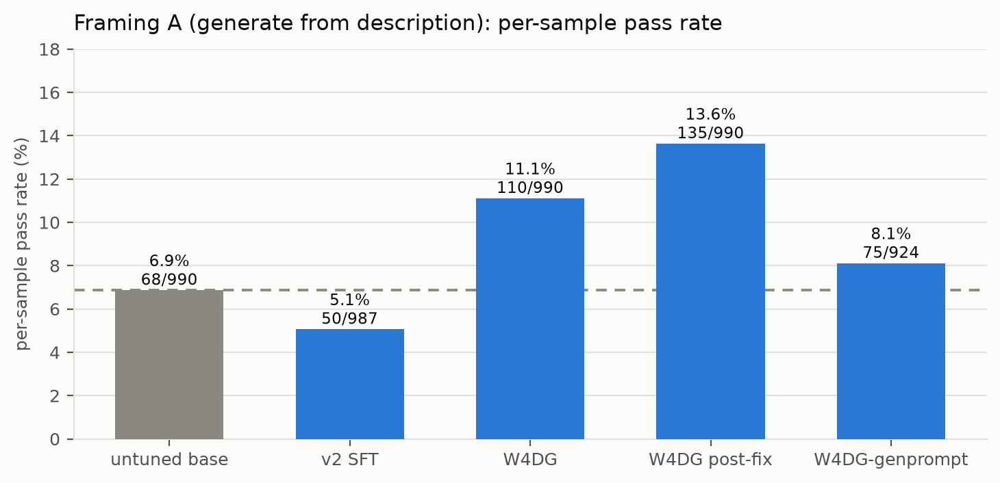
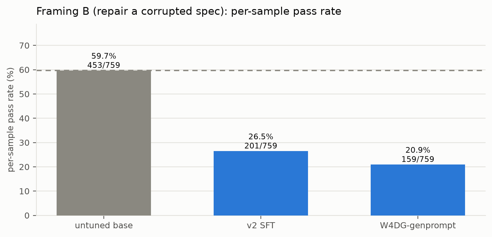
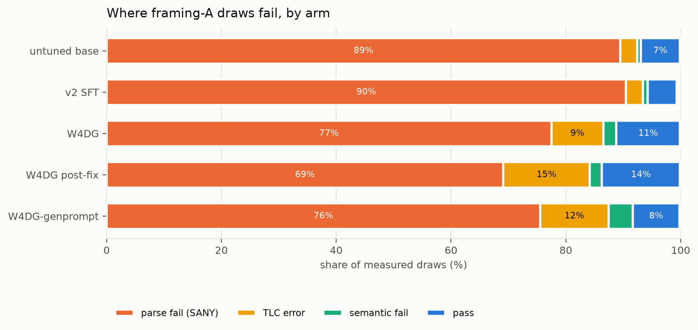
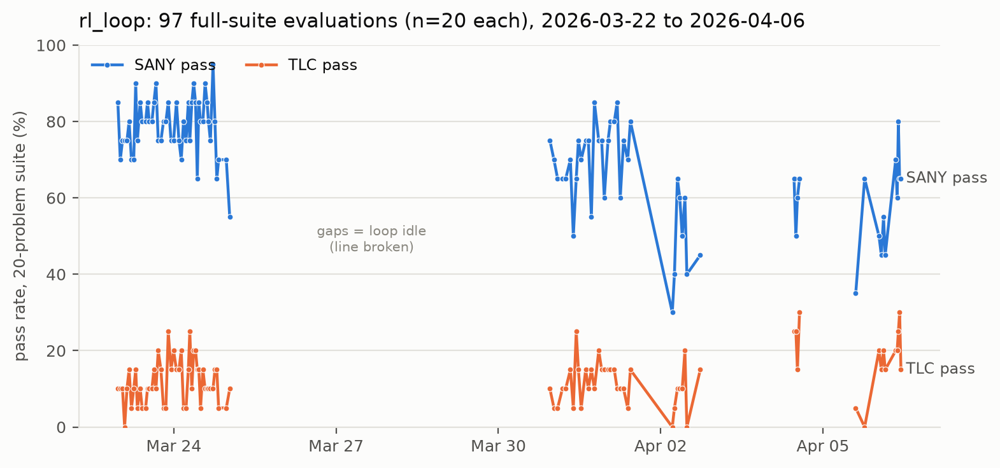
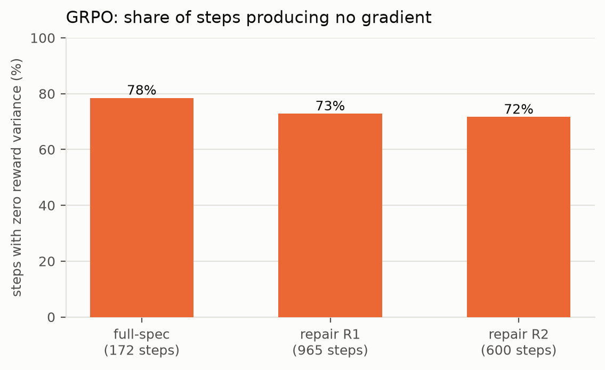

# Fine-tuning a TLA+ prover: every run and every measurement, 2026-03 to 2026-08

Figures regenerate from `tools/brief_figures.py`. Gate-2 rates are recomputed from
`results/runs/*/rows.jsonl` at build time: `(spec, sample)` deduplicated keep-first,
corruption rows dropped, `api_error` excluded from the denominator as an unmeasured
draw. RL-era training metrics are read from TLA-Prove logs surviving at git
`e79a250` and `511a492`.

## Performance by arm

{width=100%}

| arm | SANY | TLC | vacuous | params | per-sample | pass@32 |
|---|---|---|---|---|---|---|
| untuned base 120b | 10.5% | 5.1% | 1/53 | untuned | 6.9% | 12/30 |
| v2 SFT | 9.0% | 3.9% | 3/40 | 536.8M | 5.1% | 11/30 |
| W4-diamond-gold | 22.5% | 6.6% | 1/52 | 536.8M | 11.1% | 15/30 |
| W4DG post prompt-fix | **30.9%** | **9.6%** | 1/78 | 536.8M | **13.6%** | 16/30 |
| W4DG-genprompt | 24.5% | 6.5% | 1/52 | 536.8M | 8.1% | 12/28 |
| mech composition | — | — | — | 536.8M | pending | pending |

`vacuous` is vacuous draws over TLC-passing draws checked; `params` is trainable
parameters at LoRA attach.

All four 120b arms attached **identical** LoRA geometry: 536,813,568 trainable
parameters, 0.4574%, 144 expert tensors, `target_modules` q/k/v/o plus
`target_parameters` on `mlp.experts.gate_up_proj` and `down_proj`. Verified from
each run's own attach-time log line. Trainable capacity is therefore constant
across every arm in this table.

`verdict_of` is population-aware, so the TLC column excludes 6 of 30 specs: 41, 86,
105 and 183 are LIBRARIES (SANY alone is the criterion) and 131, 142 are
PROOF_MODULES (TLAPS). The TLC denominator is the remaining 24 specs.

Vacuity is only computed on a TLC-passing draw, so the denominator is small (40–78
draws per arm) and the counts are shown rather than percentages alone.

The RL-era runs are not on this chart. They were evaluated on a different holdout
(Diamond-30) under a four-shot repair loop, and their `sany_valid` field is a
residual category rather than a pass rate — `holdout_repair.json` records
`sany_valid=0` alongside 9 TLC-gold results. Those numbers are in the Diamond-30
section below.

## Every run

| # | date | run | base | corpus | outcome |
|---|---|---|---|---|---|
| 1 | 03-22→04-06 | rl_loop, 266 cycles | 20b | augmented, append-only | SANY 80%→65%, TLC 10%→25% |
| 2 | 04-03 | DPO v13 | 20b | 17 preference pairs | 9/20 SANY, 5/20 TLC (v11: 6/20, 2/20) |
| 3 | ~04-10 | piecewise DPO | merged v14 | curriculum pairs | loss 0.6661 vs ln2 0.6931; acc 0.60 |
| 4 | 04-11 | full-spec GRPO | post-DPO | 398 prompts | 172 steps; holdout 4/30, 1-shot 1/30 |
| 5 | 04-12 | repair GRPO R1 | post-DPO | ralph repair pairs | 965 steps; holdout 9/30, 1-shot 3/30 |
| 6 | 04-13 | repair GRPO R2 | post-DPO | R2 harvest | 600 steps; holdout 6/30, 1-shot 1/30 |
| 7 | 04-14 | repair GRPO R3 | — | — | aborted: 152 pairs vs floor 300 |
| 8 | 07-01 | repair GRPO retry | 20b | 35 rows | 89 steps zero reward; 1/7 rows; reverted |
| 9 | 07-12 | v2_sft1 | 20b | 39 plain-text pairs | 0/10; 82% unextractable |
| 10 | 07-13 | v2_sft2 | 20b | 260 harmony pairs | 2/30 pass@4 — first passes recorded |
| 11 | 07-14 | v2_sft2 | 120b | 260 | A 5.1%, 11/30; B 26.5%, 18/23 |
| 12 | 07-25 | W2.6 repair-v1 | 20b | 508 repair triples | B 9/23 pass@1, 9/23 pass@4 |
| 13 | 07-29 | W4-diamond-gold | 120b | 3,534 rows, bare | A 11.1%, 15/30 |
| 14 | 07-30 | W4DG, post prompt-fix | 120b | same | A 13.6%, 16/30 |
| 15 | 08-04 | W4DG-genprompt | 120b | 4,219 rows, aligned | A 8.1%, 12/28; B 20.9%, 17/23 |
| 16 | 08-12 | mech composition | 120b | 6,906 (4,119 gen + 2,787 repair) | training; eval pending |

Runs 1–8 are `LUC-AI4FM/TLA-Prove` on 2× RTX 8000 49GB. Runs 9–16 are `prove-TLA`
on Argonne Sophia, 8× A100. A further arm, Qwen3.6-27B dense, is retracted: a
gpt-oss-specific `target_parameters` selector matched nothing on a dense model,
leaving the FFN at 0.0195% trainable while the job exited 0.

## Framing A — generate a spec from a description

30-spec frozen holdout, k=32, temp 0.8.

{width=100%}

| arm | per-sample | pass@32 | rows scored | api_error |
|---|---|---|---|---|
| untuned base 120b | 6.9% (68/990) | 12/30 | 990 | 0 |
| v2 SFT | 5.1% (50/987) | 11/30 | 987 | 3 |
| W4-diamond-gold | 11.1% (110/990) | 15/30 | 990 | 0 |
| W4DG post prompt-fix | 13.6% (135/990) | 16/30 | 990 | 0 |
| W4DG-genprompt | 8.1% (75/924) | 12/28 | 924 | 66 |

Paired two-level bootstrap, restricted to the 17 specs whose `prompt_sha256` is
byte-identical across arms: W4DG vs base **+0.086, p=0.063**; W4DG-genprompt vs
base **−0.018, p=0.66**. The `required_signature` fix changed 13 of 30 framing-A
prompts on 2026-07-29, so rows either side of that date are not directly comparable
outside the 17-spec matched set.

W4DG-genprompt lost specs 183 and 191 in full (66 api_error rows) to a serve
walltime expiry; its denominator is 28 specs.

## Framing B — repair a corrupted spec

23-spec denominator, k=33.

{width=100%}

| arm | per-sample | pass@32 |
|---|---|---|
| untuned base 120b | 59.7% (453/759) | 21/23 |
| v2 SFT | 26.5% (201/759) | 18/23 |
| W4DG-genprompt | 20.9% (159/759) | 17/23 |

W4DG framing B reached 110 of 990 rows before the serve died and is not scored here.

## Where the draws fail

{width=100%}

Verdict buckets: `parse fail` = `fail:sany=*`; `TLC error` = `fail:tlc=error` and
`fail:tlc=timeout`; `semantic fail` = `fail:tlc=fail_invariant`, `fail_deadlock`,
`fail_liveness`.

| arm | parse fail | TLC error | semantic fail | pass |
|---|---|---|---|---|
| untuned base | 89.5% | 2.9% | 0.6% | 6.9% |
| v2 SFT | 90.5% | 2.9% | 0.8% | 5.1% |
| W4-diamond-gold | 77.5% | 9.1% | 2.2% | 11.1% |
| W4DG post prompt-fix | 69.1% | 15.1% | 2.1% | 13.6% |
| W4DG-genprompt | 75.5% | 11.9% | 4.2% | 8.1% |

Rows do not sum to 100%: 0.1–0.7% per arm is `fail:tlaps=error` or an unmatched
verdict. `fail:sany=fail_missing_module` is counted under parse fail.

## rl_loop, 266 cycles

Computed from all 97 full-suite CSVs (n=20 each) in
`outputs/benchmark_results`. Quick-eval CSVs (n=12, 107 files) are excluded.

{width=100%}

All 228 CSVs record the model as `chattla:20b`, a mutable Ollama tag rewritten on
each redeploy; no CSV is attributable to a specific checkpoint. The projection in
`README_RL_SETUP.txt` was 85% SANY and 40–50% TLC after ~15 cycles.

## GRPO reward variance

`frac_reward_zero_std == 1` means every completion in the sampled group scored
identically, so the advantage and the update are both zero.

{width=100%}

| run | steps | mean reward | zero-var steps | KL | entropy |
|---|---|---|---|---|---|
| full-spec | 172 | 0.0511 | 135/172 (78%) | 0.002–0.014 | 0.44 → 0.32 |
| repair R1 | 965 | 0.1487 | 703/965 (73%) | 0.002–0.014 | 0.003–0.3 |
| repair R2 | 600 | 0.0930 | 430/600 (72%) | — | — |

Repair R1's mean reward of 0.1487 equals the shaping function's hard-coded
"no change" constant of 0.15 (`repair_reward.py:70`). At temperature 0.5 the July
run emitted byte-identical completions within a group. No reward hacking and no
verifier false positives were found in any run.

## Diamond-30 holdout, RL era

Three numbers rest on this holdout. The 9/30 is published as 30% Gold
(arXiv:2606.06133; AUDIT.md:12; docs/formallm.md:25).

| eval | fixed | single-shot | timeouts | tiers |
|---|---|---|---|---|
| full-spec GRPO | 4/30 | 1/30 | 2 | 4 gold, 5 silver |
| repair R1 | 9/30 | 3/30 | 4 | 9 gold |
| repair R2 | 6/30 | 1/30 | 1 | 6 gold, 2 silver |

Three properties of this holdout, each verified directly:

- All 30 holdout module names appear in `data/diamond_gen_topics.json`.
  `fullspec_dataset.py` defaults `include_topics=True`, `train_rl_fullspec.py`
  passes it, and the loader implements no holdout filter. The SFT path does filter
  by module name (`train.py:110`).
- The eval is a four-shot repair loop with verifier feedback at temperatures 0.50,
  0.70, 0.90. Single-shot counts above are rows with `result == fixed` and
  `attempts_used == 1`.
- `repair_pipeline.log` records `LoRA merge FAILED` at 00:31:19; the next line
  starts the eval against Ollama tag `chattla:20b-repair`. No log shows that tag
  rebuilt from the R1 adapter.

## Corpora

| corpus | rows | liveness | top family | comment density | used by |
|---|---|---|---|---|---|
| v2 harmony | 260 | — | — | — | runs 10, 11 |
| W2.6 repair triples | 508 | — | — | — | run 12 |
| W4-diamond-gold | 3,534 | 6.2% | mutex_locks 35.8% | — | runs 13, 14 |
| W4DG 5010-render | 4,119 | 12.4% | mutex_locks 35.5% | 3.9% of lines; 38.7% of targets carry 1+ comment | run 15 base |
| W4DG-genprompt | 4,219 | — | — | — | run 15 |
| mech composition | 6,906 | — | — | — | run 16 |

W4 corpus mutation-catch rate: **12.7%** real (69% of survivors have no mutation
site the battery can kill). Public TLA+ liveness rate for reference: 23–34%.

Oracle repair pairs in run 16: 4,000 survivors attempted, 2,787 kept (1,981 SANY-class,
806 TLC-class, 69.7% yield). Each pair is a corrupted survivor whose corruption was
executed against SANY/TLC and kept only if it actually fails, with the original
Opus-teacher text as the target.

## Defects found

| # | layer | defect | exit code | status |
|---|---|---|---|---|
| 1 | training | `target_parameters` hardcoded for gpt-oss; dense FFN frozen at 0.0195% | 0 | fixed + aborting floor |
| 2 | training | `is_moe()` read only top-level config; Qwen3.5-35B-A3B's 256 experts resolved as dense | 0 | fixed |
| 3 | training | PBS echoed `TRAIN_EXIT=$?` then exited 0 | 0 | fixed, 18 scripts |
| 4 | training | `Mxfp4Config` passed by family not checkpoint; transformers 5.12.1 refuses | 1 | fixed |
| 5 | training | 2-GPU `CUDA_VISIBLE_DEVICES` hardcode | — | fixed |
| 6 | training | staging tree held stale `lora_resolver.py` / `train.py` | — | fixed, verified per-run |
| 7 | eval | `required_signature` dropped cfg substitution RHS; 13/30 framing-A prompts under-specified | — | fixed 07-29 |
| 8 | eval | serve `--max-model-len 4096` truncated 4.4k–17k-token repair prompts | — | fixed, run quarantined |
| 9 | eval | `summary.json` written from in-memory rows, understated resumed runs | — | ledger-only scoring |
| 10 | eval | `api_error` rows counted as done on resume | — | open, bitten twice |
| 11 | eval | pass@32 collapses 32 draws to 1 bit | — | per-sample now primary |

Four of the six training defects exited 0 on runs that had not trained what they
were supposed to train.

## Not yet tried

| lever | status | cost |
|---|---|---|
| mechanics supervision | run 16, training now | spent |
| grammar-constrained decoding | 2 EBNF grammars scaffolded (`tla_module_v0.ebnf`, `tla_proof_v0.ebnf`); no decoder wired | no training compute |
| multi-task split (generation / repair / abduction / fuzzing) | verifiers exist for all four; never trained jointly | 1 train run |
| RL restart | trainers reusable; blocked on `frac_reward_zero_std` | 1 measurement, then 1 run |
| holdout widening past 30 specs | effects below ~4 points unresolvable at n=30 | amendment + decontam pass |

## Open measurements

- Run 16 eval: framings A and B, k=32.
- W4DG-genprompt specs 183 and 191: 66 rows unmeasured.
- W4DG framing B: 880 of 990 rows unmeasured.
- Difficulty probe: 436 of 2,400 rows short; measures pass rate under the training
  prompt rather than the eval prompt.
